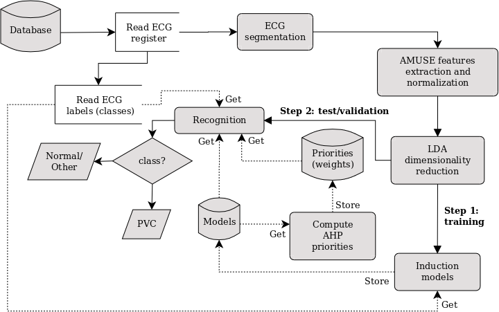

# Premature Ventricular Contraction Recognition 

The available source codes are part of the research entitled "Premature Ventricular Contraction Recognition using Blind Source Separation and Gaussian Naive Bayes Ensemble weighted by Analytic Hierarchy Process" published in the Journal <a href="https://periodicos.uem.br/ojs/index.php/ActaSciTechnol">Acta Scientiarum. Technology</a>.

Abstract: Premature Ventricular Contractions arrhythmias can be associated with sudden death and acute myocardial infarction and occurs in the 50% of the population for Holter monitoring. PVC patterns are very hard to recognizing as their waveforms can be confused with other heartbeats, such as Right and Left Bundle Branch Block. In this work it is proposed a new approach for PVC recognition, based on Gaussian Naive Bayes algorithm and AMUSE, which is a method for blind source separation problem. This approach provides a set of attributes which are combined by Linear Discriminant Analysis, allowing the training of an ensemble learning. Each learned model is weighted by the Analytic Hierarchy Process according to its importance, obtained from the performance metrics. This approach has some advantages over baseline methods as it does not use a pre-processing stage and employs a simple machine learning model, that is trained using only two parameters for each feature. Using a common dataset for training and test, the proposed approach achieves 98.75% of accuracy, 90.65% of sensitivity and 99.46% of specificity. For other datasets, the best performance was 99.57% of accuracy, 98.64% of sensitivity and 99.65% of specificity. In general, the proposed approach is better than most state-of-the-art methods for some performance metrics.

Block diagram of the proposed approach. 

